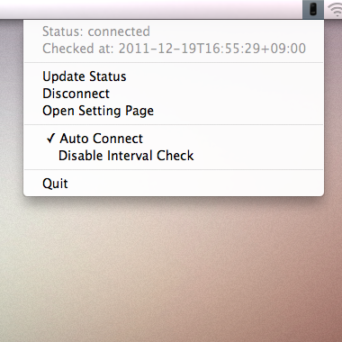
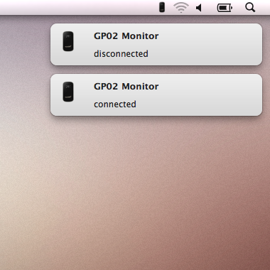

# Emobile GP02 Monitor

## Requirements

 * Mac OS X 10.6 or higher.
 * Macruby 0.10 or higher.

## How to Use

 % macruby gp02monitor.rb

## Launchd

Edit macruby and gp02monitor.rb path in launchd.plist.

    % launchctl load launchd.plist
    % launchctl unload launchd.plist

## Developing without GP02

    % node server.js
    % macruby gp02monitor.rb -d

## License

The MIT License Copyright (c) 2011 swdyh
http://www.opensource.org/licenses/mit-license.php

